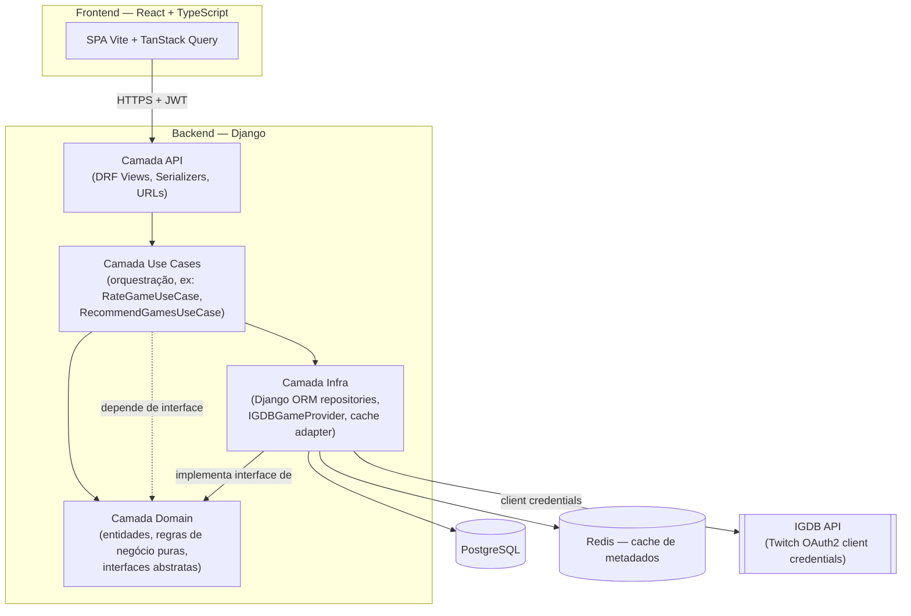

# Parallaxis — Arquitetura do Sistema

## 1. Princípio arquitetural central

O backend segue **Clean Architecture simplificada**, organizada em camadas com uma regra de dependência única e não-negociável: **camadas internas nunca conhecem camadas externas**. Concretamente:

- `domain/` (entidades e regras de negócio puras) não importa nada de Django, DRF, IGDB ou banco de dados.
- `use_cases/` (orquestração da lógica de aplicação) depende de `domain/`, mas só conhece **interfaces** abstratas de infraestrutura (ex: `GameDataProvider`, que já desenhamos), nunca a implementação concreta.
- `infra/` (Django ORM, cliente HTTP da IGDB, Redis) implementa essas interfaces, e é a única camada que sabe que Django/IGDB/Postgres existem.
- `api/` (views, serializers, urls do DRF) é a camada de entrada — traduz requisição HTTP em chamada de use case, e resultado de use case em resposta HTTP.

Essa é a aplicação prática do Dependency Inversion Principle discutido lá atrás com o `GameDataProvider`: a seta de dependência aponta sempre para dentro (`infra` → `use_cases` → `domain`), nunca o contrário. Isso é o que permite trocar Django por outro framework, ou IGDB por RAWG, sem tocar em `domain/` ou `use_cases/`.

## 2. Diagrama de arquitetura

## 3. Fluxo de dados — exemplo prático (avaliar um jogo)

1. Usuário busca "Hollow Knight" no frontend → requisição para `GET /api/games/search?q=hollow+knight`.
2. Camada API recebe, valida autenticação (JWT), chama `SearchGamesUseCase`.
3. Use case pede ao `GameDataProvider` (interface) os resultados — não sabe se a implementação por trás é IGDB.
4. `IGDBGameProvider` (infra) primeiro consulta o cache Redis; se houver cache miss, autentica via client-credentials (renovando token se expirado), consulta a IGDB, salva no cache com TTL de 7 dias, retorna ao use case.
5. Use case devolve o resultado para a camada API, que serializa como JSON.
6. Usuário seleciona o jogo e atribui nota → `POST /api/library-entries`, tratado por `RateGameUseCase`, que aplica as regras de domínio (RN01, RN02, RN09) antes de persistir via repositório (infra).

## 4. Decisão registrada: sem Celery no MVP

Esse era um ponto que deixamos em aberto lá atrás — está resolvido agora. **Não incluir Celery no MVP.** Motivo: revisando os requisitos fechados, não existe nenhum fluxo que exija processamento assíncrono real — a busca na IGDB acontece sob demanda (não há sincronização periódica agendada, como haveria em algo tipo o DevPulse) e o cálculo de análise/recomendação é rápido o suficiente para rodar de forma síncrona dentro do tempo de resposta esperado (RNF01). Adicionar Celery agora seria complexidade de infraestrutura sem um problema real para resolver — vai para o backlog como melhoria futura caso o volume de dados ou a complexidade do motor de recomendação cresçam a ponto de justificar. Redis continua no stack, mas com um único papel no MVP: cache (via `django-redis`), não fila de mensagens.

## 5. Frontend

O frontend consome a API via um client HTTP centralizado (Axios, reaproveitando o padrão do projeto anterior, mas corrigindo o bug de endpoint identificado), com TanStack Query gerenciando cache/loading/erro de cada chamada. Não há camada de "use case" formal no frontend — a complexidade de negócio mora inteiramente no backend; o frontend é responsável por apresentação e validação de formulário (react-hook-form + zod), não por regra de negócio.
