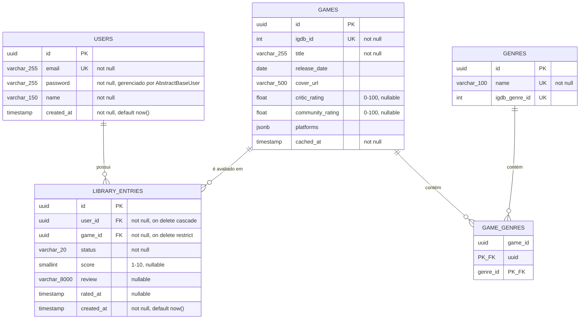

# Parallaxis — Modelo Entidade-Relacionamento (MER)

Este documento formaliza o modelo de domínio em estrutura relacional real (tipos, chaves, constraints). Como decidimos que o diagrama físico do banco seria coberto pelas próprias migrations do Django, este MER é o nível de detalhe final antes do código — as migrations devem espelhar exatamente o que está aqui.

## 1. Decisão de chave primária

Todas as tabelas usam **UUID como chave primária**, não `SERIAL`/auto-incremento. Motivo: IDs sequenciais expõem informação (ex: dá para estimar quantos usuários existem, ou "adivinhar" o próximo ID válido em `/api/games/124`) — UUID evita enumeração de recursos, um cuidado de segurança simples e barato de implementar desde o início (RNF de segurança).

## 2. Nomenclatura física das tabelas

Os nomes das entidades abaixo (`USERS`, `GAMES`, etc.) são conceituais — o Django gera o nome físico real da tabela pela convenção `<app_label>_<nome_do_model_minúsculo>`, sem tentarmos sobrescrever via `db_table`. Isso foi uma decisão consciente (não um desvio não percebido): forçar nomes customizados de tabela é mais comum em projetos legados migrando de um schema pré-existente, não faz sentido aqui, onde o banco nasce junto com o código.

| Entidade conceitual (este documento) | Tabela física real (Postgres)                                                                                   |
| ------------------------------------ | --------------------------------------------------------------------------------------------------------------- |
| `USERS`                              | `users_user`                                                                                                    |
| `GAMES`                              | `games_game`                                                                                                    |
| `GENRES`                             | `games_genre`                                                                                                   |
| `LIBRARY_ENTRIES`                    | `games_libraryentry`                                                                                            |
| `GAME_GENRES` (junção N:N)           | `games_game_genres` (gerada automaticamente pelo Django a partir do `ManyToManyField`, sem `through` explícito) |

Ao ler o restante deste documento, mentalmente troque `library_entries` por `games_libraryentry` e assim por diante ao consultar o banco real via `psql`/DBeaver.

## 3. Diagrama ER

## 4. Constraints e regras aplicadas em nível de banco

Mermaid não representa `CHECK` constraints visualmente, então formalizo aqui — essas restrições vão diretamente para as migrations Django (via `CheckConstraint` no `Meta` do model). Nomes de tabela na coluna já refletem o físico real (ver seção 2):

| Tabela               | Constraint                                                               | Regra de negócio correspondente                                               |
| -------------------- | ------------------------------------------------------------------------ | ----------------------------------------------------------------------------- |
| `games_libraryentry` | `UNIQUE (user_id, game_id)`                                              | RN01 — um jogo não pode se repetir na biblioteca do mesmo usuário             |
| `games_libraryentry` | `CHECK (score IS NULL OR score BETWEEN 1 AND 10)`                        | RN02 (parte 1) — nota, quando existe, é 1-10                                  |
| `games_libraryentry` | `CHECK (status NOT IN ('completed', 'abandoned') OR score IS NOT NULL)`  | RN02 (parte 2) — nota obrigatória apenas quando concluído/abandonado          |
| `games_libraryentry` | `CHECK (length(review) <= 8000)`                                         | RN08 — limite de review                                                       |
| `games_game`         | `CHECK (critic_rating IS NULL OR critic_rating BETWEEN 0 AND 100)`       | Escala real da IGDB (`aggregated_rating`, confirmada na documentação oficial) |
| `games_game`         | `CHECK (community_rating IS NULL OR community_rating BETWEEN 0 AND 100)` | Escala real da IGDB (`rating`)                                                |
| `games_game`         | `UNIQUE (igdb_id)`                                                       | Evita duplicar cache do mesmo jogo externo                                    |
| `users_user`         | `UNIQUE (email)`                                                         | Login único por e-mail                                                        |

**Nota sobre `ON DELETE`:**

- `games_libraryentry.user_id` → `CASCADE`: implementa RN07 (exclusão de conta remove todos os registros associados).
- `games_libraryentry.game_id` → `RESTRICT`: um `Game` nunca deve ser removido enquanto houver `LibraryEntry` referenciando ele — isso é dado de cache compartilhado, não deveria ser deletado de forma trivial via cascade acidental.

## 5. Índices recomendados

Pensados a partir dos filtros e agregações que os requisitos exigem (RF13, RF15-RF18):

| Índice                                 | Motivo                                                                                     |
| -------------------------------------- | ------------------------------------------------------------------------------------------ |
| `games_libraryentry (user_id)`         | Toda listagem de biblioteca (RF13) filtra por usuário — consulta mais frequente do sistema |
| `games_libraryentry (user_id, status)` | Filtro por status (RF11/RF13) combinado com usuário                                        |
| `games_libraryentry (user_id, score)`  | Suporta filtro por faixa de nota e as agregações de RF15-RF17                              |
| `games_game (igdb_id)`                 | Já garantido pela `UNIQUE`, mas vale destacar — é o ponto de entrada do cache (RNF05)      |
| `games_genre (name)`                   | Já garantido pela `UNIQUE` — usado em agrupamento de distribuição por gênero (RF15)        |

## 6. Por que `games_game_genres` não tem `id` próprio

A tabela de junção usa chave primária composta (`game_id`, `genre_id`), não um `id` substituto. Como essa tabela não carrega nenhum atributo próprio (é uma relação pura N:N, sem metadado adicional tipo "data em que o gênero foi associado"), uma chave substituta seria redundante — a combinação dos dois FKs já garante unicidade da relação. Isso é o comportamento padrão do Django para `ManyToManyField` sem `through` customizado.

## 7. Nota sobre o campo de senha

O campo é `password`, não `password_hash` como o texto inicial deste documento sugeria — `AbstractBaseUser` do Django usa especificamente esse nome de atributo internamente (`set_password()`/`check_password()`), e reescrever isso exigiria sobrescrever várias peças internas do framework para ganho zero. Apesar do nome, o valor gravado **sempre** é o hash, nunca a senha em texto plano — é assim em todo projeto Django.

---

Com o MER fechado (e agora refletindo os nomes reais gerados pelo código), o próximo artefato da sequência é a **Arquitetura do Sistema + ADR de stack**.

Com o MER fechado (e agora refletindo os nomes reais gerados pelo código), o próximo artefato da sequência é a **Arquitetura do Sistema + ADR de stack**.
