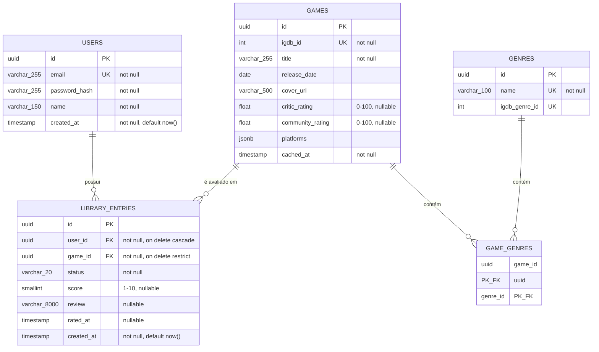

# Parallaxis — Modelo Entidade-Relacionamento (MER)

Este documento formaliza o modelo de domínio em estrutura relacional real (tipos, chaves, constraints). Como decidimos que o diagrama físico do banco seria coberto pelas próprias migrations do Django, este MER é o nível de detalhe final antes do código — as migrations devem espelhar exatamente o que está aqui.

## 1. Decisão de chave primária

Todas as tabelas usam **UUID como chave primária**, não `SERIAL`/auto-incremento. Motivo: IDs sequenciais expõem informação (ex: dá para estimar quantos usuários existem, ou "adivinhar" o próximo ID válido em `/api/games/124`) — UUID evita enumeração de recursos, um cuidado de segurança simples e barato de implementar desde o início (RNF de segurança).

## 2. Diagrama ER

## 3. Constraints e regras aplicadas em nível de banco

Mermaid não representa `CHECK` constraints visualmente, então formalizo aqui — essas restrições vão diretamente para as migrations Django (via `CheckConstraint` no `Meta` do model):

| Tabela            | Constraint                                                               | Regra de negócio correspondente                                               |
| ----------------- | ------------------------------------------------------------------------ | ----------------------------------------------------------------------------- |
| `library_entries` | `UNIQUE (user_id, game_id)`                                              | RN01 — um jogo não pode se repetir na biblioteca do mesmo usuário             |
| `library_entries` | `CHECK (score IS NULL OR score BETWEEN 1 AND 10)`                        | RN02 (parte 1) — nota, quando existe, é 1-10                                  |
| `library_entries` | `CHECK (status NOT IN ('COMPLETED', 'ABANDONED') OR score IS NOT NULL)`  | RN02 (parte 2) — nota obrigatória apenas quando concluído/abandonado          |
| `library_entries` | `CHECK (length(review) <= 8000)`                                         | RN08 — limite de review                                                       |
| `games`           | `CHECK (critic_rating IS NULL OR critic_rating BETWEEN 0 AND 100)`       | Escala real da IGDB (`aggregated_rating`, confirmada na documentação oficial) |
| `games`           | `CHECK (community_rating IS NULL OR community_rating BETWEEN 0 AND 100)` | Escala real da IGDB (`rating`)                                                |
| `games`           | `UNIQUE (igdb_id)`                                                       | Evita duplicar cache do mesmo jogo externo                                    |
| `users`           | `UNIQUE (email)`                                                         | Login único por e-mail                                                        |

**Nota sobre `ON DELETE`:**

- `library_entries.user_id` → `CASCADE`: implementa RN07 (exclusão de conta remove todos os registros associados).
- `library_entries.game_id` → `RESTRICT`: um `Game` nunca deve ser removido enquanto houver `LibraryEntry` referenciando ele — isso é dado de cache compartilhado, não deveria ser deletado de forma trivial via cascade acidental.

## 4. Índices recomendados

Pensados a partir dos filtros e agregações que os requisitos exigem (RF13, RF15-RF18):

| Índice                              | Motivo                                                                                     |
| ----------------------------------- | ------------------------------------------------------------------------------------------ |
| `library_entries (user_id)`         | Toda listagem de biblioteca (RF13) filtra por usuário — consulta mais frequente do sistema |
| `library_entries (user_id, status)` | Filtro por status (RF11/RF13) combinado com usuário                                        |
| `library_entries (user_id, score)`  | Suporta filtro por faixa de nota e as agregações de RF15-RF17                              |
| `games (igdb_id)`                   | Já garantido pela `UNIQUE`, mas vale destacar — é o ponto de entrada do cache (RNF05)      |
| `genres (name)`                     | Já garantido pela `UNIQUE` — usado em agrupamento de distribuição por gênero (RF15)        |

## 5. Por que `GAME_GENRES` não tem `id` próprio

A tabela de junção usa chave primária composta (`game_id`, `genre_id`), não um `id` substituto. Como essa tabela não carrega nenhum atributo próprio (é uma relação pura N:N, sem metadado adicional tipo "data em que o gênero foi associado"), uma chave substituta seria redundante — a combinação dos dois FKs já garante unicidade da relação.
