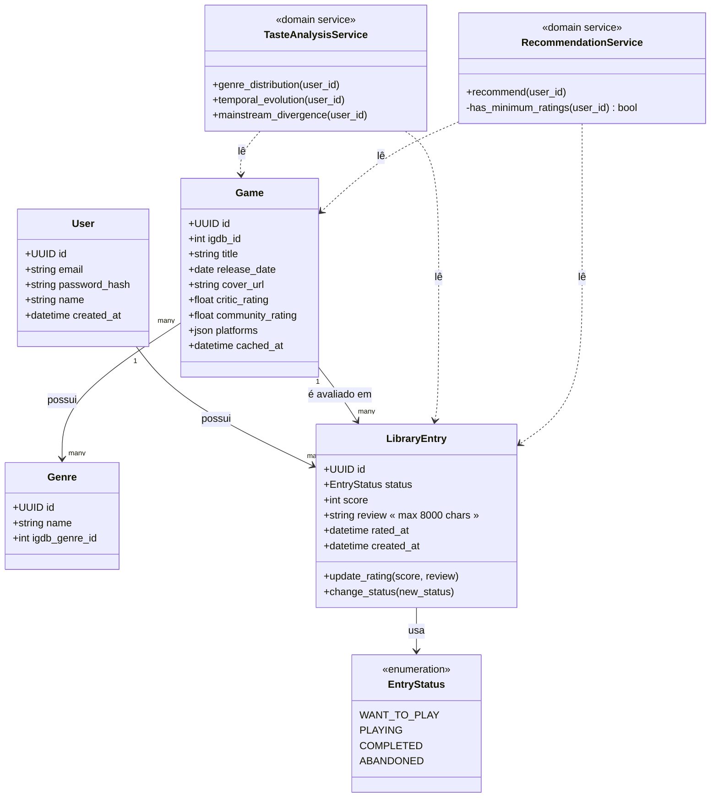

# Parallaxis — Modelo de Domínio e Diagrama de Classes

## 1. Entidades e decisões de modelagem

### `User`

Representa a conta. Campos mínimos para autenticação e identificação — nada além disso entra aqui (preferências de análise, por exemplo, não são atributo do usuário, são _derivadas_ dos dados de `LibraryEntry`, não guardadas nele).

### `Game`

Representa o jogo, com metadados vindos da IGDB e cacheados localmente (RNF05). Importante: `Game` guarda o `igdb_id` como referência externa, não usa o ID da IGDB como chave primária interna — isso isola o domínio da fonte de dado externa (se um dia trocarmos de provider, como discutimos com a abstração `GameDataProvider`, a chave interna não muda).

### `Genre`

Decisão de modelagem: **normalizei gênero como entidade própria**, com relação N:N para `Game`, em vez de guardar como lista solta dentro do jogo. Motivo: gênero é o eixo central de praticamente toda a análise de gosto (RF15, RF17, RF18) — normalizar permite queries agregadas eficientes no banco (`GROUP BY genre`), e é exatamente o tipo de modelagem relacional que vale a pena demonstrar num MER.

### `platforms` (dentro de `Game`, não normalizado)

Decisão oposta e deliberada: plataformas ficam como um campo de lista simples (JSON/array), não uma entidade própria com tabela de junção. Motivo: plataforma só é usada como filtro (RF13), nunca como eixo de agregação/análise — criar uma tabela `Platform` + junção só para isso seria complexidade sem retorno (overengineering que já concordamos em evitar).

### `LibraryEntry`

É o **agregado central** do domínio — a entidade que conecta `User` e `Game`, e onde vivem as regras de negócio mais importantes:

- Aplica RN01 (constraint de unicidade `user_id` + `game_id`).
- Aplica RN02 (nota obrigatória apenas quando status é `COMPLETED` ou `ABANDONED`).
- Aplica RN03/RN06 (o método `update_rating` é responsável por atualizar `rated_at` sempre que a nota/review muda — isso não pode ser uma atribuição solta de campo, tem que ser um método que garanta a regra, ou alguém no futuro edita o campo direto e quebra a regra silenciosamente).

Decisão de nome: chamei de `LibraryEntry`, não de `Rating`, porque a entidade cobre mais que uma nota — cobre status de progresso (RF11) mesmo antes de existir nota nenhuma. "Rating" sugeriria que a nota é obrigatória desde a criação, o que RN02 explicitamente nega.

### Não modelei como entidade persistida: análise de gosto e recomendação

Essa é a decisão mais importante do documento, então vale destacar o raciocínio. Cogitei criar uma entidade `TasteProfile` ou `AnalysisSnapshot` para guardar os resultados de RF15-RF18, mas decidi **não persistir** isso como entidade — pelo menos não no MVP. Motivo:

- O volume de dados esperado (biblioteca de um usuário, algumas centenas de jogos no limite) torna o cálculo em tempo real trivial em termos de performance — não há RNF que justifique pré-computar e armazenar.
- Persistir um "snapshot" de análise introduz um problema novo que não existia: manter esse snapshot sincronizado toda vez que uma avaliação muda (RN06). Isso é complexidade de invalidação de cache que não compensa no estágio atual.
- Se no futuro o volume crescer ou a análise ficar computacionalmente cara, a resposta certa é adicionar cache (Redis, com TTL curto, invalidado ao criar/editar `LibraryEntry`) — não uma tabela nova. Isso fica registrado como decisão consciente de arquitetura (bom material para um ADR).

Por isso, `TasteAnalysisService` e `RecommendationService` aparecem no diagrama como **serviços de domínio** (stateless, sem tabela própria), não como entidades — eles leem `LibraryEntry` + `Game` sob demanda e calculam o resultado na hora.

---

## 2. Diagrama de Classes

---

## 3. Rastreabilidade com os requisitos

| Entidade/Serviço        | Requisitos que atende             |
| ----------------------- | --------------------------------- |
| `User`                  | RF01–RF05                         |
| `Game` + `Genre`        | RF06, RF07, RNF05                 |
| `LibraryEntry`          | RF08–RF14, RN01, RN02, RN03, RN06 |
| `TasteAnalysisService`  | RF15, RF16, RF17, RN05            |
| `RecommendationService` | RF18, RN04                        |

---

## 4. Decisões registradas

1. **Limite de review**: 8000 caracteres, mesma ordem de grandeza usada pela Steam para reviews de usuários (RN08).

2. **`critic_rating` vs `community_rating`**: mantidos como dois campos explícitos e separados no `Game`, refletindo que a IGDB fornece as duas métricas de forma distinta e que elas carregam significado diferente para o cálculo de divergência (RF17).
   _Decisão de arquitetura consciente:_ optei por **não generalizar antecipadamente** para uma estrutura tipo `ExternalRating(game_id, source, rating_type, value)`, mesmo sabendo que Steam (e possivelmente outras fontes) pode entrar no futuro. Com uma única fonte confirmada hoje (IGDB), generalizar agora seria pagar complexidade por um requisito hipotético — a estrutura genérica deve ser introduzida como refatoração no momento em que uma segunda fonte de rating for de fato implementada, não antes. Vale registrar isso como ADR quando chegarmos na documentação de arquitetura.

3. **Exclusão de conta**: cascade delete de todos os registros de `LibraryEntry` do usuário ao excluir a conta (RN07), em conformidade com o direito de eliminação de dados da LGPD. `Game` não é afetado — é cache compartilhado entre usuários, não dado pessoal.
